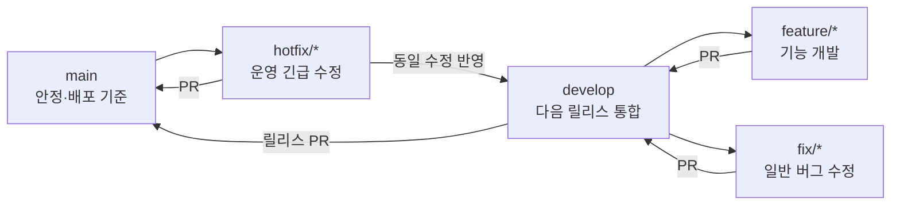

# Debut 개발 워크플로

이 문서는 Debut 모노레포의 브랜치, Pull Request, Spec 기반 개발 규칙을 정의한다.

## 1. 적용 전략

Debut은 현재 다음 두 장기 브랜치를 사용하는 가벼운 통합 전략을 적용한다.



현대적인 GitHub Flow와 trunk-based development의 핵심인 짧은 브랜치, 작은 변경, 빈번한 통합, PR 검토를 유지하되 `main`을 항상 시연·배포 가능한 상태로 보존하기 위해 `develop`을 통합 브랜치로 둔다.

이 저장소가 충분한 자동 테스트, Preview 환경, feature flag를 갖추면 `main` 중심의 단일 trunk 전략으로 단순화할 수 있다. 그 전까지 `develop`을 두 번째 장기 작업 저장소로 만들지 않는 것이 중요하다.

외부 기준:

- [GitHub flow](https://docs.github.com/en/get-started/using-github/github-flow)
- [GitHub protected branches](https://docs.github.com/en/repositories/configuring-branches-and-merges-in-your-repository/managing-protected-branches/about-protected-branches)
- [DORA trunk-based development](https://dora.dev/capabilities/trunk-based-development/)
- [DORA working in small batches](https://dora.dev/capabilities/working-in-small-batches/)

## 2. 브랜치 역할

| 브랜치 | 시작점 | 병합 대상 | 역할 |
| --- | --- | --- | --- |
| `main` | - | - | 안정·배포 기준. 직접 개발하지 않는다. |
| `develop` | `main`의 최신 릴리스 | `main` | 다음 릴리스에 들어갈 검증된 변경 통합 |
| `feature/<기능명>` | 최신 `develop` | `develop` | 사용자 기능, UI/UX, 도메인 기능 개발 |
| `fix/<수정명>` | 최신 `develop` | `develop` | 아직 배포되지 않은 일반 버그 수정 |
| `docs/<문서명>` | 최신 `develop` | `develop` | 독립적인 문서·Spec 체계 변경 |
| `hotfix/<수정명>` | 최신 `main` | `main`, 이후 `develop` | 운영 기준의 긴급 수정 |

`feature/*`를 `main`에서 만들지 않는다. 예외는 운영 긴급 수정인 `hotfix/*`뿐이다.

## 3. 브랜치 이름

브랜치 이름은 소문자 영문과 하이픈을 사용하고 범위를 드러낸다.

```text
feature/workspace-navigation
feature/workspace-docs-ux
feature/workspace-chat-auth
fix/workspace-presence-cleanup
docs/workspace-spec-rules
hotfix/interview-session-start
```

- `feature/workspace`, `feature/update`, `fix/bug`처럼 범위가 불명확한 이름은 피한다.
- 개인·도구 이름 접두사는 사용하지 않는다.
- 한 브랜치는 하나의 Spec 또는 하나의 명확한 수정만 담당한다.

현재 `feature/workspace-foundation`은 워크스페이스 공통 기반 정리까지만 담당한다. 모든 후속 워크스페이스 기능을 계속 누적하는 영구 브랜치로 사용하지 않는다.

## 4. 기능 개발 시작

```bash
git switch develop
git pull --ff-only origin develop
git switch -c feature/<기능명>
```

개발 중에는 `develop`과 차이가 지나치게 커지지 않도록 자주 동기화한다.

```bash
git fetch origin
git rebase origin/develop
```

이미 여러 사람이 공유하는 브랜치는 임의로 rebase/force-push하지 않는다. 그런 경우에는 팀과 합의해 merge로 동기화한다.

## 5. 작은 배치 원칙

- 한 PR은 하나의 사용자 가치 또는 하나의 기술적 목적을 가진다.
- 브랜치는 가능한 한 수일 안에 병합한다. 더 길어지면 독립적으로 검증 가능한 작업으로 나눈다.
- UI, API, DB 전체를 한 번에 크게 바꾸기보다 호환 가능한 작은 단계로 나눈다.
- 완성 전 노출되면 안 되는 기능은 장기 브랜치 대신 feature flag 또는 숨겨진 진입점을 사용한다.
- 생성형 AI가 많은 코드를 만들 수 있더라도 검토·테스트 가능한 크기를 우선한다.

## 6. Spec 기반 AI 주도 개발

워크스페이스처럼 `web`, BFF, DB, 실시간 서버를 함께 바꾸는 기능은 코드 작성 전에 `specs/`에 명세한다.

```text
specs/<도메인>/<번호>-<기능명>/
├── spec.md
├── ux.md
├── plan.md
├── data-model.md
├── tasks.md
├── verification.md
├── contracts/
└── assets/
```

전체 규칙은 [`specs/README.md`](specs/README.md)를 따른다.

기본 순서:

1. `spec.md`에서 문제, 목표, 비목표, 요구사항, 인수 조건을 작성한다.
2. 사람이 검토해 상태를 `approved`로 변경한다.
3. `ux.md`, `plan.md`, 데이터/API/Socket 계약을 확정한다.
4. `tasks.md`를 의존성 순서로 쪼갠다.
5. Spec과 같은 범위의 브랜치를 만든다.
6. AI는 Task 단위로 구현하고 검증한다.
7. `verification.md`에 요구사항별 결과를 남긴다.
8. PR에서 Spec, 코드, 테스트 결과를 함께 검토한다.

승인되지 않은 Spec을 근거로 구현을 시작하지 않는다. 구현 중 요구사항이 바뀌면 코드만 우회 수정하지 말고 Spec과 작업 목록을 먼저 갱신한다.

## 7. 커밋

커밋은 변경 목적이 드러나도록 작성한다.

```text
feat(workspace): add authenticated socket handshake
fix(workspace): remove stale Yjs awareness on disconnect
docs(workspace): define collaboration event contracts
test(workspace): cover chat membership authorization
refactor(workspace): separate room authorization service
```

- 생성 파일, 임시 로그, 비밀값을 커밋하지 않는다.
- 서로 되돌려야 할 가능성이 다른 변경은 커밋을 분리한다.
- DB 스키마 초기화나 데이터 삭제를 일반 개발 절차에 포함하지 않는다.

## 8. Pull Request

feature/fix/docs 브랜치는 `develop`을 base로 PR을 만든다.

PR 본문에 다음을 포함한다.

- 연결된 Spec 경로와 요구사항 ID
- 변경 범위와 범위 밖 항목
- UI 변경 전후 화면 또는 영상
- API·DB·Socket.IO·Yjs 계약 변경
- 실행한 자동 테스트와 수동 검증
- 알려진 위험, 후속 작업, 롤백 방법

병합 전 확인:

- 최신 base와 충돌이 없다.
- 관련 lint, typecheck, test, build가 통과한다.
- 리뷰 의견과 대화가 해결됐다.
- 기능과 현재 문서가 일치한다.
- 비밀값과 불필요한 생성물이 없다.

feature/fix PR은 가능한 한 squash merge하여 하나의 목적 단위로 `develop`에 남긴다. `develop`에서 `main`으로 올리는 릴리스는 별도 PR로 검증하고 릴리스 경계를 보존한다.

## 9. 릴리스와 긴급 수정

릴리스:

1. `develop`의 대상 기능과 회귀 검증을 완료한다.
2. `develop → main` PR을 만든다.
3. 배포 전 검사와 리뷰를 통과한다.
4. 병합 후 `main` 배포를 확인한다.

긴급 수정:

1. 최신 `main`에서 `hotfix/<수정명>`을 만든다.
2. 최소 범위로 수정하고 회귀 검증한다.
3. `main`에 PR로 병합한다.
4. 동일 수정이 빠지지 않도록 `develop`에도 즉시 반영한다.

## 10. 저장소 보호 권장값

GitHub에서 `main`, `develop`에 ruleset 또는 branch protection을 설정한다.

- Pull Request 없이 직접 병합 금지
- 필수 status check 통과
- 최소 1명 승인
- 미해결 대화가 있으면 병합 금지
- force push와 브랜치 삭제 금지
- 자동 테스트가 안정화되면 linear history 또는 merge queue 검토

현재 저장소에 실제로 설정된 보호 규칙과 이 문서가 다르면 저장소 관리자가 GitHub 설정을 확인해 맞춘다.
