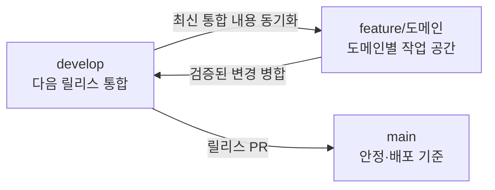

# Debut 개발 워크플로

이 문서는 Debut 모노레포의 브랜치, Pull Request, AI 협업 개발 규칙을 정의한다.

## 1. 적용 전략

Debut은 안정 기준 `main`, 통합 기준 `develop`, 도메인별 작업 공간 `feature/<도메인>`을 유지한다. 작업마다 브랜치를 새로 만들지 않고 담당 도메인 브랜치에서 작은 커밋으로 진행한다.



브랜치 수 대신 커밋 크기를 작게 유지한다. `feature/<도메인>`은 여러 기능을 무제한 쌓아두는 별도 제품선이 아니라, 자주 `develop`과 동기화하고 검증된 단위로 다시 합치는 작업 공간이다.

## 2. 브랜치 역할

| 브랜치 | 시작점 | 병합 대상 | 역할 |
| --- | --- | --- | --- |
| `main` | - | - | 안정·배포 기준. 직접 개발하지 않는다. |
| `develop` | `main`의 최신 릴리스 | `main` | 다음 릴리스에 들어갈 검증된 변경 통합 |
| `feature/<도메인>` | 최신 `develop` | `develop` | 해당 도메인의 기능, UI/UX, 버그, 문서, 리팩터링 작업 공간 |

긴급 수정도 별도 `hotfix/*`를 만들지 않는다. 해당 `feature/<도메인>`에서 최소 수정하고 `develop`, `main` 순서로 빠르게 반영한다.

## 3. 브랜치 이름

작업 브랜치는 `feature/<도메인>` 형식만 사용한다. 이름은 저장소의 서비스 또는 명확한 업무 도메인과 맞춘다.

```text
feature/workspace
feature/ai-interview
feature/web
feature/crawler
feature/repo
```

- 기능명을 브랜치에 붙이거나 `feature/<도메인>/<기능명>` 하위 브랜치를 만들지 않는다.
- `fix/*`, `docs/*`, `hotfix/*` 접두사는 만들지 않는다.
- 개인·도구 이름 접두사는 사용하지 않는다.
- 작업 성격과 범위는 커밋 메시지, Issue, Spec에서 구분한다.

## 4. 기능 개발 시작

도메인 브랜치가 없다면 최신 `develop`에서 한 번만 만든다.

```bash
git switch develop
git pull --ff-only origin develop
git switch -c feature/<도메인>
git push -u origin feature/<도메인>
```

이미 존재하면 새 브랜치를 만들지 않고 이동한 뒤 `develop`을 병합해 동기화한다.

```bash
git switch feature/<도메인>
git fetch origin
git merge origin/develop
```

공유하는 도메인 브랜치에는 rebase와 force push를 사용하지 않는다.

## 5. 작은 배치 원칙

- 하나의 작은 작업은 기본적으로 하나의 이해 가능한 커밋으로 남긴다.
- 기능 구현, 무관한 리팩터링, 문서 정리는 되돌릴 단위가 다르면 커밋을 나눈다.
- UI, API, DB 전체를 한 번에 크게 바꾸기보다 호환 가능한 작은 단계로 나눈다.
- 완성 전 노출되면 안 되는 기능은 feature flag 또는 숨겨진 진입점을 사용한다.
- 생성형 AI가 많은 코드를 만들 수 있더라도 검토·테스트 가능한 크기를 우선한다.

## 6. AI 주도 개발과 최소 Spec

모든 변경에 Spec을 만들지 않는다. 문구·스타일·작은 버그·로컬 리팩터링은 커밋 메시지와 검증 결과만으로 협업한다.

사용자 동작이 바뀌거나 여러 모듈을 함께 변경하는 기능은 `specs/<도메인>/<기능명>.md` 한 장으로 시작한다. 인증·권한·데이터 마이그레이션·공용 인터페이스처럼 위험하거나 되돌리기 어려운 변경에만 필요한 계약 문서나 ADR을 추가한다.

전체 판단 기준과 최소 템플릿은 [`specs/README.md`](specs/README.md)를 따른다.

기본 순서:

1. 현재 코드와 관련 문서를 확인한다.
2. 필요하면 Why, Outcome, Boundaries, Done when만 담은 Spec을 작성한다.
3. 사람이 제품 범위와 중요한 결정을 확인한다.
4. AI가 작은 단위로 구현하고 테스트한다.
5. 커밋 또는 통합 PR에서 변경 내용과 검증 결과를 함께 검토한다.
6. 현재 동작이 바뀌면 프로젝트 기준 문서 또는 서비스 README를 갱신한다.

사용자가 명확하게 구현을 요청한 일반 작업에는 별도의 승인 상태를 요구하지 않는다. AI는 제품 범위를 임의로 넓히지 않으며, 파괴적 작업·보안·권한·데이터 변경처럼 중요한 결정만 구현 전에 다시 확인한다.

## 7. 커밋

커밋은 변경 목적이 드러나도록 작성한다.

```text
feat(workspace): add authenticated socket handshake
fix(workspace): remove stale Yjs awareness on disconnect
docs(workspace): define collaboration event contracts
test(workspace): cover chat membership authorization
refactor(workspace): separate room authorization service
```

- 생성 파일, 임시 로그, 비밀값을 커밋하지 않는다.
- 서로 되돌려야 할 가능성이 다른 변경은 커밋을 분리한다.
- DB 스키마 초기화나 데이터 삭제를 일반 개발 절차에 포함하지 않는다.

## 8. Pull Request

`feature/<도메인>`의 검증된 변경을 `develop`에 합칠 때 필요하면 통합 PR을 만든다. 작업마다 PR을 만들 필요는 없다.

PR 본문은 [기본 템플릿](.github/pull_request_template.md)에 따라 다음을 포함한다.

- 변경 이유
- 핵심 변경
- 실행한 자동 테스트와 수동 검증
- 관련 Issue·Spec, UI 화면, 계약 변경, 위험과 롤백 정보는 해당할 때만

병합 전 확인:

- 최신 base와 충돌이 없다.
- 관련 lint, typecheck, test, build가 통과한다.
- 리뷰 의견과 대화가 해결됐다.
- 기능과 현재 문서가 일치한다.
- 비밀값과 불필요한 생성물이 없다.

재사용하는 도메인 브랜치의 공통 조상을 보존하기 위해 squash merge하지 않는다. 일반 merge 후 최신 `develop`을 다시 도메인 브랜치에 병합한다. `develop`에서 `main`으로 올리는 릴리스는 별도로 검증한다.

## 9. 릴리스와 긴급 수정

릴리스:

1. `develop`의 대상 기능과 회귀 검증을 완료한다.
2. `develop → main` PR을 만든다.
3. 배포 전 검사와 리뷰를 통과한다.
4. 병합 후 `main` 배포를 확인한다.

긴급 수정:

1. 해당 `feature/<도메인>`을 최신 `develop`과 동기화한다.
2. 최소 범위로 수정하고 회귀 검증한다.
3. `develop`에 병합한 뒤 `main`에 우선 반영한다.
4. 배포 후 도메인 브랜치를 최신 `develop`과 다시 동기화한다.

## 10. 저장소 보호 권장값

GitHub에서 `main`, `develop`에 ruleset 또는 branch protection을 설정한다.

- Pull Request 없이 직접 병합 금지
- 필수 status check 통과
- 최소 1명 승인
- 미해결 대화가 있으면 병합 금지
- `main`, `develop`의 force push와 삭제 금지
- 공유 `feature/<도메인>` 브랜치의 force push와 삭제 금지
- 자동 테스트가 안정화되면 linear history 또는 merge queue 검토

현재 저장소에 실제로 설정된 보호 규칙과 이 문서가 다르면 저장소 관리자가 GitHub 설정을 확인해 맞춘다.
