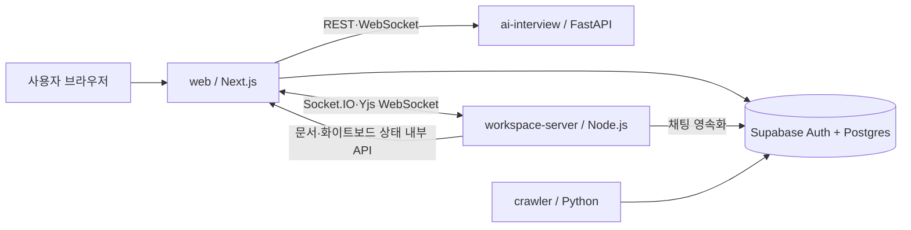

# Debut Capstone Demo

부천대학교 캡스톤 프로젝트 `Debut` 모노레포입니다. `Debut`은 **Dev + 벗(친구)**이라는 뜻으로, 개발자의 취업 준비와 팀 협업을 함께하는 동료를 지향합니다.

- AI 면접(텍스트/음성)
- 실시간 워크스페이스(화이트보드/문서/채팅)
- 기술 블로그/개발 이벤트 수집

## 아키텍처 & 인프라


```mermaid
flowchart LR
    U[사용자 브라우저] --> W[web / Next.js]
    W --> S[(Supabase Auth + Postgres)]
    W -->|REST·WebSocket| I[ai-interview / FastAPI]
    W <-->|Socket.IO·Yjs WebSocket| R[workspace-server / Node.js]
    R -->|채팅 영속화| S
    R -->|문서·화이트보드 상태 내부 API| W
    C[crawler / Python] --> S
```

사용자 트래픽은 **Vercel**에 배포된 `web`(Next.js)으로 들어오고, REST/WSS로 **Render**의 두 백엔드와 통신합니다 — 면접 엔진 `ai-interview`(FastAPI)와 실시간 협업 `workspace-server`(Node). 데이터와 인증은 **Supabase**(Postgres + Auth)가 맡습니다. 면접·생성 파이프라인은 Gemini·OpenAI·LiveKit·GitHub API 등 외부 서비스를 사용하며, `crawler`(Python)는 수집 결과를 Supabase에 적재합니다.

> 현재 제품·운영 기준은 [프로젝트 기준 문서](docs/PROJECT_REFERENCE.md)입니다. `web`은 프론트엔드이자 BFF API를 직접 운영하고, `ai-interview`는 AI 면접 전문 엔진입니다.

## 모노레포 구성

| 디렉토리 | 역할 | 기본 포트 | 배포 |
|---|---|---:|---|
| `web/` | Next.js 프론트 + BFF API | 3000 | Vercel |
| `ai-interview/` | 면접 엔진 FastAPI | 8001 | Render |
| `workspace-server/` | Socket.IO + Yjs 서버 | 4000 | Render |
| `crawler/` | RSS/이벤트 수집기 | - | GitHub Actions/수동 |
| `docs/` | 설계/운영 문서 | - | - |

## 로컬 실행 순서

### 1) 환경변수 파일 준비

```bash
cp web/.env.example web/.env.local
cp ai-interview/.env.example ai-interview/.env
cp workspace-server/.env.example workspace-server/.env
cp crawler/.env.example crawler/.env
```

### 2) 서버 실행

```bash
# web
cd web && npm install && npm run dev

# ai-interview
cd ai-interview && uv sync && uv run uvicorn app.main:app --reload --port 8001

# workspace-server
cd workspace-server && npm install && npm run dev

# crawler (필요 시)
cd crawler && uv sync
```

## 배포 & CI/CD

개발자가 GitHub 레포에 푸시하면 연동된 Git Hook이 각 플랫폼의 빌드를 트리거합니다. `web`은 **Vercel Git Hook**으로, `ai-interview`/`workspace-server`는 **Render Git Hook**으로 자동 배포됩니다. 웹에는 백엔드 API/WSS URL과 내부 통신 시크릿을, Render 서비스에는 DB 연결·BFF 주소·AI/LiveKit 자격증명 등 각 서비스가 요구하는 환경변수를 주입합니다.

현재 Render 서비스 URL은 배포 환경에서 확인합니다.

- AI 면접 서버: `AI_INTERVIEW_BASE_URL`
- 워크스페이스 서버: `NEXT_PUBLIC_WS_URL`, `NEXT_PUBLIC_SOCKET_URL`

웹 배포 시 주요 env:

- `AI_INTERVIEW_BASE_URL=https://<ai-interview-service>`
- `NEXT_PUBLIC_AI_WS_URL=wss://<ai-interview-service>/v1/interview/ws/client`
- `NEXT_PUBLIC_WS_URL=wss://<workspace-service>`
- `NEXT_PUBLIC_SOCKET_URL=wss://<workspace-service>`

## 개발 워크플로

- 브랜치·Pull Request·커밋 규칙: [CONTRIBUTING.md](CONTRIBUTING.md)
- AI 주도 개발과 최소 Spec 규칙: [specs/README.md](specs/README.md)

현재 저장소는 `main`을 안정·배포 기준, `develop`을 다음 릴리스 통합 기준으로 사용합니다. 실제 작업은 `feature/workspace`, `feature/ai-interview`처럼 도메인별 브랜치에서 작은 커밋으로 진행하고 검증된 변경을 `develop`, 이후 `main`에 반영합니다. 작업마다 별도 브랜치를 만들지 않습니다.

## 문서 바로가기

- **제품·운영 기준:** [docs/PROJECT_REFERENCE.md](docs/PROJECT_REFERENCE.md)
- **개발·브랜치 기준:** [CONTRIBUTING.md](CONTRIBUTING.md)
- **기능 명세 기준:** [specs/README.md](specs/README.md)
- 웹: [web/README.md](web/README.md)
- AI 면접 서버: [ai-interview/README.md](ai-interview/README.md)
- 워크스페이스 전체 코드 구조: [workspace-server/README.md](workspace-server/README.md)
- 워크스페이스 코드 인수인계: [workspace-server/HANDOVER.md](workspace-server/HANDOVER.md)
- 크롤러: [crawler/README.md](crawler/README.md)
- 기술 인수인계 문서: [PROJECT_HANDOVER_KR.md](PROJECT_HANDOVER_KR.md)
