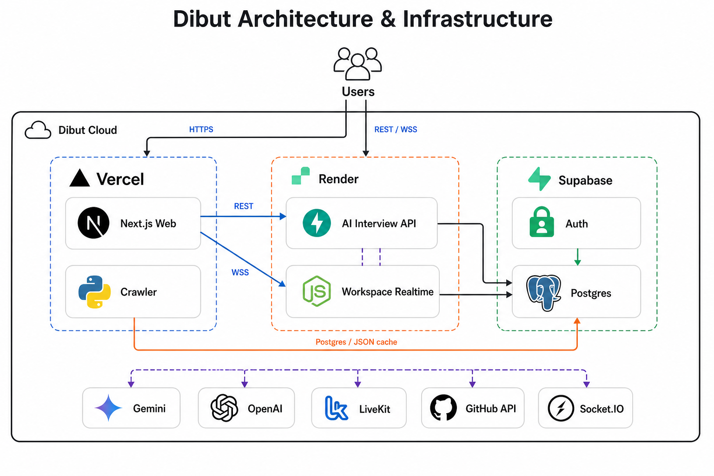
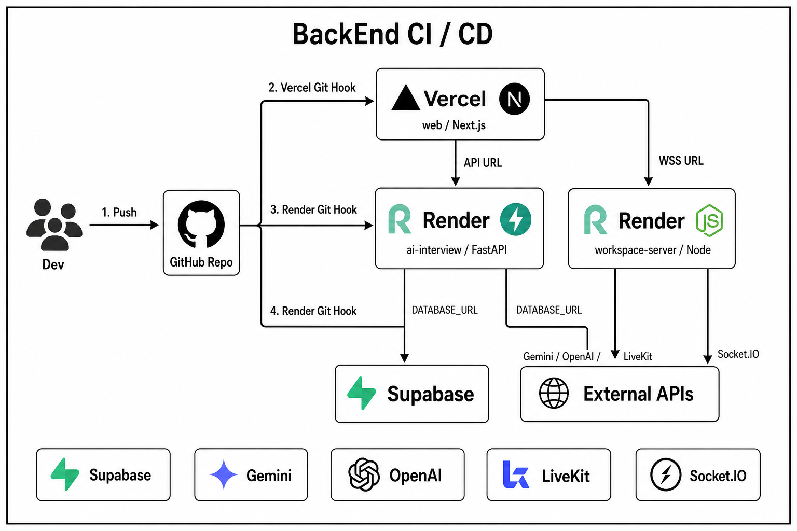

# Dibut Capstone Demo

부천대학교 캡스톤 프로젝트 `Dibut(Buddy for Developers)` 모노레포입니다.

- AI 면접(텍스트/음성)
- 실시간 워크스페이스(화이트보드/문서/채팅)
- 기술 블로그/개발 이벤트 수집

## 아키텍처 & 인프라

<p align="center">
  
</p>

사용자 트래픽은 **Vercel**에 배포된 `web`(Next.js)으로 들어오고, REST/WSS로 **Render**의 두 백엔드와 통신합니다 — 면접 엔진 `ai-interview`(FastAPI)와 실시간 협업 `workspace-server`(Node). 데이터와 인증은 **Supabase**(Postgres + Auth)가 맡습니다. 면접·생성 파이프라인은 Gemini·OpenAI·LiveKit·GitHub API·Socket.IO 등 외부 서비스를 사용하며, `crawler`(Python)는 수집 결과를 Postgres에 JSON 캐시로 적재합니다.

## 모노레포 구성

| 디렉토리 | 역할 | 기본 포트 | 배포 |
|---|---|---:|---|
| `web/` | Next.js 프론트 + BFF API | 3000 | Vercel |
| `ai-interview/` | 면접 엔진 FastAPI | 8001 | Render |
| `workspace-server/` | Socket.IO + Yjs 서버 | 4000 | Render |
| `crawler/` | RSS/이벤트 수집기 | - | Cron/수동 |
| `docs/` | 설계/운영 문서 | - | - |

## 로컬 실행 순서

### 1) 환경변수 파일 준비

```bash
cp web/.env.example web/.env.local
cp ai-interview/.env.example ai-interview/.env
cp workspace-server/.env.example workspace-server/.env
cp crawler/.env.example crawler/.env
```

### 2) 서버 실행

```bash
# web
cd web && pnpm install && pnpm dev

# ai-interview
cd ai-interview && uv sync && uv run uvicorn app.main:app --reload --port 8001

# workspace-server
cd workspace-server && npm install && npm run dev

# crawler (필요 시)
cd crawler && uv sync
```

## 배포 & CI/CD

<p align="center">
  
</p>

개발자가 GitHub 레포에 푸시하면 연동된 Git Hook이 각 플랫폼의 빌드를 트리거합니다. `web`은 **Vercel Git Hook**으로, `ai-interview`/`workspace-server`는 **Render Git Hook**으로 자동 배포됩니다. 빌드 시 Vercel은 백엔드 API/WSS URL을, Render 서비스들은 `DATABASE_URL`과 외부 API 키(Gemini·OpenAI·LiveKit·Socket.IO)를 환경변수로 주입받습니다.

현재 Render 서비스 URL 예시:

- `https://ai-interview-9p40.onrender.com`
- `https://dibut-workspace-server.onrender.com`

웹 배포 시 주요 env:

- `AI_INTERVIEW_BASE_URL=https://ai-interview-9p40.onrender.com`
- `NEXT_PUBLIC_AI_WS_URL=wss://ai-interview-9p40.onrender.com/v1/interview/ws/client`
- `NEXT_PUBLIC_WS_URL=wss://dibut-workspace-server.onrender.com`
- `NEXT_PUBLIC_SOCKET_URL=wss://dibut-workspace-server.onrender.com`

## 문서 바로가기

- 웹: [web/README.md](web/README.md)
- AI 면접 서버: [ai-interview/README.md](ai-interview/README.md)
- 워크스페이스 서버: [workspace-server/README.md](workspace-server/README.md)
- 크롤러: [crawler/README.md](crawler/README.md)
- 성능 최적화·QA 검증 보고서: [docs/reports/2026-06-03-performance-optimization-report.md](docs/reports/2026-06-03-performance-optimization-report.md)
- 회귀 테스트 계획서: [docs/qa/2026-06-03-regression-test-plan.md](docs/qa/2026-06-03-regression-test-plan.md)
