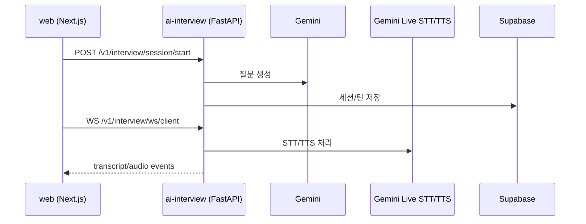

# Dibut AI Interview API (FastAPI)

AI 면접 질문 생성, 세션 저장, 음성 WebSocket(STT/TTS) 처리를 담당하는 백엔드입니다.

## 구조



## 주요 엔드포인트 (2026-07 실측)

**공통**: `GET /health` · `GET /docs`(OpenAPI)

**면접 (`/v1/interview`)**
- 파싱: `POST /parse-job` · `POST /parse-resume` — 웹 BFF가 공고/이력서 등록 시 프록시로 호출
- 세션: `POST /session/start` · `POST /sessions/{id}/prepare-opening` · `POST /sessions/{id}/complete` · `GET /sessions` · `GET /sessions/{id}`
- 리포트: `GET /sessions/{id}/report-status`(폴링) · `POST /sessions/{id}/retry-report`
- 음성: `WS /v1/interview/ws/client` (Gemini Live STT/TTS, `ws_runtime`)
- 화상: `POST /livekit/token`
- 포트폴리오 디펜스: `POST /portfolio/analyze-public-repo` · `POST /portfolio/session/start` · `POST /portfolio/chat`
- 기타: `POST /chat` · `POST /analyze` · `GET /health`

**이력서 (`/v1/resume`)**: `POST /normalize`

**관리 (`/admin`)**: `GET /admin/health` 등

> 참고: 웹 BFF의 면접 텍스트 채팅 라우트(`web/app/api/interview/chat`)는 410으로 폐기되어 음성 면접이 기본입니다. 세션 목록/상세 조회는 BFF가 FastAPI를 거치지 않고 Supabase를 직접 읽는 특례가 있습니다 (소유권 검사 포함).

## 환경변수

| 키 | 필수 | 설명 |
|---|---|---|
| `DATABASE_URL` | 예 | Postgres 연결 문자열 |
| `GEMINI_API_KEY` | 예 | 질문 생성/분석 LLM |
| `GEMINI_MODEL` | 아니오 | 기본 `gemini-2.5-flash` |
| `GEMINI_LIVE_STT_MODEL` | 아니오 | 기본 `gemini-2.5-flash-native-audio-latest` |
| `GEMINI_TTS_MODEL` | 아니오 | 기본 `gemini-2.5-flash-preview-tts` |
| `GEMINI_LIVE_TTS_MODEL` | 아니오 | TTS fallback용 Live 모델(기본 `gemini-2.5-flash-native-audio-latest`) |
| `GEMINI_LIVE_TTS_VOICE` | 아니오 | 기본 `Kore` |
| `GITHUB_TOKEN` | 권장 | GitHub API rate limit 회피 및 공개 레포 분석 안정화 |
| `CORS_ORIGINS` | 예 | 웹 도메인 목록(콤마 구분) |
| `LIVEKIT_URL` | 선택 | 라이브킷 연동 시 |
| `LIVEKIT_API_KEY` | 선택 | 라이브킷 연동 시 |
| `LIVEKIT_API_SECRET` | 선택 | 라이브킷 연동 시 |
| `VOICE_VAD_THRESHOLD` | 아니오 | 기본 `0.015` |
| `VOICE_VAD_SILENCE_MS` | 아니오 | 기본 `700` |
| `VOICE_MIN_SPEECH_MS` | 아니오 | 기본 `350` |
| `VOICE_MAX_SEGMENT_MS` | 아니오 | 기본 `10000` |

## 로컬 실행

```bash
cd ai-interview
cp .env.example .env
uv sync
uv run uvicorn app.main:app --reload --port 8001
```

확인:

```bash
curl http://localhost:8001/health
```

## Render 배포 설정

- Root Directory: `ai-interview`
- Runtime: `Python`
- Build Command: `uv sync --frozen --no-dev`
- Start Command: `uv run --frozen --no-dev --no-sync uvicorn app.main:app --host 0.0.0.0 --port $PORT`

배포 후 확인:

- `https://<service>.onrender.com/health`
- `https://<service>.onrender.com/docs`

## 개발 메모

- 루트 `/`는 라우트가 없어 404가 정상입니다.
- 음성 면접을 운영하려면 `GEMINI_API_KEY`를 반드시 넣어야 합니다.
