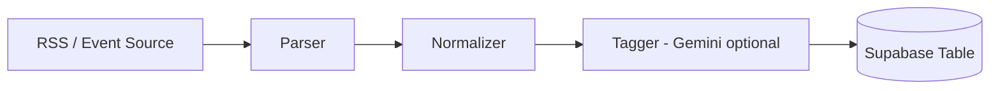

# Dibut Crawler

기술 블로그 RSS와 개발 이벤트를 수집해서 Supabase를 정본으로 동기화하는 크롤러 모듈입니다.

## 수집 파이프라인



## 실행 전 준비

```bash
cd crawler
cp .env.example .env
uv sync
```

## 실행 명령

### Tech Blog 수집

```bash
uv run python -m src.apps.tech_blog.cli
```

### Dev Event 수집

```bash
uv run python -m src.apps.dev_event.cli --limit 10
```

### Legacy JSON 1회 시드

```bash
uv run python -m src.apps.dev_event.seed --file ./data/dev-events.json
```

`dev_event`는 `source_key` 기준으로 upsert되고, 이번 실행에 더 이상 존재하지 않는 기존 `github` 소스 행사는 삭제됩니다.

## GitHub Actions

- `dev-event-sync`: 6시간마다 `uv run python -m src.apps.dev_event.cli --limit 0`
- `tech-blog-sync`: 6시간마다 `uv run python -m src.apps.tech_blog.cli`
- 둘 다 `workflow_dispatch` 를 지원합니다.
- Actions secret은 최소 `SUPABASE_URL`, `SUPABASE_SERVICE_ROLE_KEY` 가 필요합니다.
- `GEMINI_API_KEY`, `FIRECRAWL_API_KEY` 는 선택이며 없으면 fallback 경로로 동작합니다.

## 주요 환경변수

| 키 | 필수 | 설명 |
|---|---|---|
| `SUPABASE_URL` | 필수 | 크롤러가 연결할 Supabase 프로젝트 URL |
| `SUPABASE_SERVICE_ROLE_KEY` | 필수 | 크롤러 쓰기 권한 키 |
| `GEMINI_API_KEY` | 선택 | AI 태깅 사용 시 |
| `SUPABASE_BLOGS_TABLE` | 선택 | 테이블명 커스텀 |
| `SUPABASE_DEV_EVENTS_TABLE` | 선택 | Dev Event 테이블명 커스텀 |
| `TAG_REQUEST_DELAY_MS` | 선택 | 블로그 태깅 요청 간격(ms) |
| `TAG_RETRY_BASE_MS` | 선택 | Gemini 태깅 재시도 backoff 기준(ms) |

## Supabase 계약

- `blogs` 테이블은 `external_url` 기준 upsert를 지원해야 합니다.
- `dev_events` 테이블은 최소한 `id`, `source_key`, `source`, `source_title`, `title`, `link`, `date`, `start_date`, `end_date`, `tags`, `category`, `status`, `summary`, `description`, `content`, `thumbnail`, `target_audience`, `fee`, `schedule`, `benefits`, `last_seen_at` 컬럼을 가져야 합니다.
- `dev_event` 동기화는 `source='github'` 범위에서 stale row 삭제를 수행합니다.

## 참고 문서

- `docs/refactoring-plan.md`
- `docs/migration-map.md`
