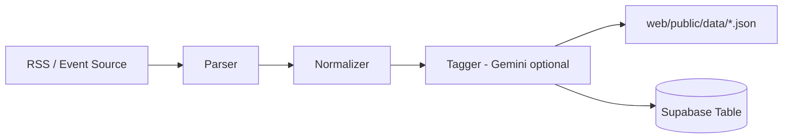

# Dibut Crawler

기술 블로그 RSS/개발 이벤트 데이터를 수집해서 JSON 또는 Supabase로 적재하는 모듈입니다.

## 수집 파이프라인



## 실행 전 준비

```bash
cd crawler
cp .env.example .env
uv sync
```

## 실행 명령

### Tech Blog 수집

```bash
uv run python -m src.apps.tech_blog.cli
```

### Dev Event 수집

```bash
uv run python -m src.apps.dev_event.cli --limit 10
```

## 주요 환경변수

| 키 | 필수 | 설명 |
|---|---|---|
| `NEXT_PUBLIC_SUPABASE_URL` | 선택 | Supabase 저장 시 |
| `SUPABASE_SERVICE_ROLE_KEY` | 선택 | Supabase 저장 시 |
| `GEMINI_API_KEY` | 선택 | AI 태깅 사용 시 |
| `WEB_DATA_DIR` | 선택 | JSON 출력 경로 변경 |
| `DEV_EVENT_JSON_PATH` | 선택 | 이벤트 파일 경로 변경 |
| `SUPABASE_BLOGS_TABLE` | 선택 | 테이블명 커스텀 |

## 참고 문서

- `docs/refactoring-plan.md`
- `docs/migration-map.md`
