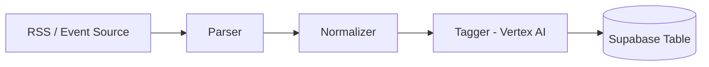

# Debut Crawler

기술 블로그 RSS/개발 이벤트 데이터를 수집해서 Supabase에 적재하는 모듈입니다.

## 수집 파이프라인


```mermaid
flowchart LR
    SRC[RSS / Event Source] --> P[Parser]
    P --> N[Normalizer]
    N --> T[Tagger - Vertex AI]
    T --> OUT[(Supabase Table)]
```

## 실행 전 준비

```bash
cd crawler
cp .env.example .env
uv sync
```

## 실행 명령

### Tech Blog 수집

```bash
uv run python -m src.apps.tech_blog.cli
```

### Dev Event 수집

```bash
uv run python -m src.apps.dev_event.cli --limit 10
```

GitHub Dev-Event README를 파싱한 뒤, 상세 페이지는 **Firecrawl + Vertex AI**로 심층 크롤링합니다(`FIRECRAWL_API_KEY` 설정 시).

### GitHub Actions

`.github/workflows/crawler.yml`이 매일 03:15(KST)에 두 크롤러를 실행합니다. GitHub Actions의 Repository Secrets에 `NEXT_PUBLIC_SUPABASE_URL`, `SUPABASE_SERVICE_ROLE_KEY`, `GOOGLE_CLOUD_PROJECT`, `GOOGLE_SERVICE_ACCOUNT_JSON_B64`를 등록해야 합니다. `GOOGLE_CLOUD_LOCATION`은 선택값이며 기본값은 `us-central1`입니다. `FIRECRAWL_API_KEY`는 개발자 행사 상세 크롤링에 필요합니다. `workflow_dispatch`로 특정 크롤러만 수동 실행할 수도 있습니다.

## 주요 환경변수

| 키 | 필수 | 설명 |
|---|---|---|
| `NEXT_PUBLIC_SUPABASE_URL` | 필수 | Supabase 연결 |
| `SUPABASE_SERVICE_ROLE_KEY` | 필수 | Supabase 쓰기 권한 |
| `GOOGLE_GENAI_USE_VERTEXAI` | 필수 | `true`로 Vertex AI 사용 |
| `GOOGLE_CLOUD_PROJECT` | 필수 | Vertex AI GCP 프로젝트 ID |
| `GOOGLE_CLOUD_LOCATION` | 선택 | Vertex AI 리전, 기본 `us-central1` |
| `GOOGLE_SERVICE_ACCOUNT_JSON_B64` | 필수 | Vertex AI 서비스 계정 JSON의 base64 값 |
| `FIRECRAWL_API_KEY` | 선택 | dev_event 상세 페이지 심층 크롤링 시 |
| `SUPABASE_BLOGS_TABLE` | 선택 | 테이블명 커스텀 |
