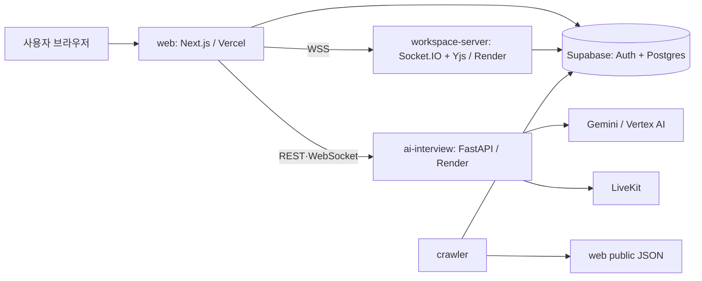

# Dibut 프로젝트 기준 문서

> 이 문서는 저장소 내 유일한 제품·운영 기준 문서다. 코드와 함께 갱신하며, 과거 계획·감사·테스트 보고서는 Git 이력에서만 조회한다.
>
> **검증 기준:** `main` / `develop` 공통 커밋 `c41d14d` (2026-07-07). 문서 정리일: 2026-07-28.

## 1. 제품 개요

Dibut(Buddy for Developers)는 개발자 취업 준비를 돕는 웹 서비스다. 핵심 기능은 다음과 같다.

| 영역 | 현재 제공 범위 |
| --- | --- |
| AI 면접 | 공고·이력서 기반 면접 준비, 음성/화상 면접, 세션·질문 기록, 분석 리포트 |
| 커리어 | 이력서·자기소개서·포트폴리오·프로젝트·경험·채용공고 관리 및 AI 보조 |
| 워크스페이스 | 문서/화이트보드, 채팅, 프레즌스 및 Yjs 기반 실시간 협업 |
| 커뮤니티 | 게시판, 댓글, 스쿼드 |
| 인사이트 | 기술 블로그와 개발 활동/이벤트 콘텐츠 |

코딩 테스트 훈련(CTP) 기능은 2026-07-28 정리 작업에서 코드와 문서 대상에서 제거되었으며, 현재 제품 범위에 포함하지 않는다.

## 2. 저장소와 런타임 구성

| 경로 | 기술 | 책임 | 기본 로컬 포트 | 배포 |
| --- | --- | --- | ---: | --- |
| `web/` | Next.js 14, React, Prisma | 사용자 UI와 주 BFF API | 3000 | Vercel (`web/vercel.json`) |
| `ai-interview/` | Python, FastAPI, uv | 면접 세션·질문·리포트·음성 WebSocket | 8001 | Render (`ai-interview/render.yaml`) |
| `workspace-server/` | Node.js, Socket.IO, Yjs, Prisma | 실시간 협업, 채팅, 프레즌스 | 4000 | Render (`workspace-server/render.yaml`) |
| `crawler/` | Python, uv | RSS/개발 이벤트 수집과 JSON·Supabase 적재 | - | 수동 또는 Cron |
| `docs/` | Markdown | 이 기준 문서와 README에서 참조하는 아키텍처 이미지 | - | - |



`web`은 단순 프록시가 아니다. `app/api/`의 BFF 라우트가 Supabase/Prisma와 AI 연동을 직접 담당하며, AI 면접 전문 처리만 `ai-interview`으로 위임한다. `workspace-server`는 `web`과 런타임 WSS로 연결되고, 자체 Prisma 스키마도 보유하므로 스키마 변경 시 두 서비스를 모두 점검한다.

## 3. 주요 화면과 API 경계

| 웹 경로 | 기능 | 주 연동 대상 |
| --- | --- | --- |
| `/career/*`, `/resume/*` | 커리어 문서·공고·포트폴리오 관리 | `web/app/api/career`, Supabase/Prisma, AI |
| `/interview/*` | 설정, 준비, 음성/화상 면접, 결과·분석 | `web/app/api/interview`, FastAPI, LiveKit |
| `/workspace/[id]` | 협업 문서/화이트보드/채팅 | Socket.IO, Yjs, workspace-server |
| `/community/*` | 게시판·스쿼드 | `web/app/api/community`, Supabase/Prisma |
| `/insights/*` | 기술 블로그·개발 활동 | BFF 및 crawler 산출물 |

`web/app/api/`는 career, community, interview, livekit, workspace 등 도메인별 라우트로 구성된다. 인증·데이터 접근은 Supabase 기반이며, 서비스 간 서버 호출은 공개 클라이언트 키가 아닌 서버 환경변수와 소유권 검사를 전제로 한다.

## 4. AI 면접 시스템

### 흐름

1. 사용자는 이력서와 채용공고를 선택하거나 입력해 면접을 설정한다.
2. `ai-interview`가 공고/이력서를 파싱하고 질문과 세션을 구성한다.
3. 음성 면접은 `WS /v1/interview/ws/client`에서 Gemini Live 기반 STT/TTS 이벤트를 주고받는다. 화상 세션은 LiveKit 토큰을 발급받아 연결한다.
4. 웹은 브라우저 `MediaRecorder`로 카메라/마이크를 함께 녹화할 수 있고, 서명 URL 또는 업로드 API로 세션 녹화물을 저장한다.
5. MediaPipe 얼굴 랜드마크 신호(시선·머리 방향 등)는 브라우저에서 약 5Hz로 수집한다. 이는 관찰 지표이며 감정이나 인격을 판정하지 않는다.
6. 세션 완료 후 비동기 리포트 작업이 질문별 피드백, JD/역량 커버리지, 답변 구간 및 분석 품질을 생성한다. 결과 화면에서 녹화 영상·구간·오버레이를 함께 확인한다.

### FastAPI 공개 경계

| 경로 | 용도 |
| --- | --- |
| `GET /health`, `GET /docs` | 상태 확인 및 OpenAPI |
| `/v1/interview/parse-job`, `/parse-resume` | 입력 문서 파싱 |
| `/v1/interview/session/*`, `/sessions/{id}/*` | 세션 시작·완료·조회·리포트 상태/재시도 |
| `WS /v1/interview/ws/client` | 실시간 음성 면접 |
| `/v1/interview/livekit/token` | 화상 면접 연결 토큰 |
| `/v1/interview/portfolio/*` | 공개 GitHub 레포 기반 포트폴리오 디펜스 |

정확한 요청/응답 계약은 FastAPI 실행 중 `/docs`를 기준으로 삼는다. 웹의 세션 목록·상세 일부는 FastAPI를 통과하지 않고 BFF가 Supabase에서 직접 읽는다.

### 주요 영속 데이터

면접 세션, 턴, 리포트와 리포트 작업, 포트폴리오 소스, 녹화 메타데이터 및 얼굴 신호가 Postgres에 저장된다. 스키마의 실제 기준은 `ai-interview/app/db/database.py`와 각 Prisma 스키마이며, 마이그레이션 또는 모델 변경 시 코드와 배포 DB를 함께 확인한다.

## 5. 환경변수와 로컬 실행

각 서비스의 `.env.example`을 먼저 복사한다. 키 전체 목록과 선택값은 해당 서비스 README를 따르며, 비밀값은 저장소에 커밋하지 않는다.

```bash
cp web/.env.example web/.env.local
cp ai-interview/.env.example ai-interview/.env
cp workspace-server/.env.example workspace-server/.env
cp crawler/.env.example crawler/.env
```

필수 연동 범주:

| 서비스 | 핵심 환경변수 |
| --- | --- |
| `web` | Supabase URL/anon key/service-role key, AI API URL·WebSocket URL, Workspace WSS URL |
| `ai-interview` | `DATABASE_URL`, Gemini 또는 Vertex AI 자격증명, `CORS_ORIGINS`; 화상 사용 시 LiveKit URL/key/secret |
| `workspace-server` | `DATABASE_URL`, `BFF_URL`, `INTERNAL_API_SECRET` |
| `crawler` | Supabase 자격증명(적재 시), Gemini/Firecrawl key(선택 기능 사용 시) |

```bash
# web
cd web && npm install && npm run dev

# AI 면접 API
cd ai-interview && uv sync && uv run uvicorn app.main:app --reload --port 8001

# 실시간 워크스페이스 서버
cd workspace-server && npm install && npm run dev

# crawler는 필요할 때
cd crawler && uv sync
```

AI 면접 상태 확인은 `curl http://localhost:8001/health`로 한다. 실제 음성·화상 흐름은 유효한 Gemini/Vertex AI 및 LiveKit 환경변수 없이는 동작하지 않는다.

## 6. 배포 기준

- 웹: Vercel에서 Root Directory를 `web`으로 설정하며, 빌드·설치는 각각 `npm run build`, `npm install`이다.
- AI 면접: Render의 `ai-interview/render.yaml`을 기준으로 Python 3.13.7과 `uv sync --frozen --no-dev`를 사용한다.
- 워크스페이스: Render의 `workspace-server/render.yaml`을 기준으로 `npm install`, `npm start`를 사용한다.
- 배포 URL, 키 이름, CORS 허용 도메인은 환경마다 다르므로 매니페스트의 예시값을 그대로 운영 값으로 간주하지 않는다.

## 7. 검증 절차

변경 범위에 맞는 최소 검증을 선택한다.

```bash
# web
cd web
npm run lint
npm run build
npm run test:interview-flow
npm run test:interview-report
npm run test:interview-recording
npm run test:interview-face
npm run test:interview-overlay
npm run test:interview-contracts

# AI 면접
cd ai-interview
uv run pytest
```

실시간 워크스페이스는 두 서버를 함께 실행한 뒤 브라우저에서 방 입장·동시 편집·채팅을 확인한다. 녹화/리포트 변경은 녹화 업로드, 세그먼트 생성, 결과 화면 재생과 오버레이까지 한 흐름으로 점검한다.

## 8. 문서 유지 원칙

1. 새 기능의 현재 동작·설정·운영 절차만 이 문서에 반영한다.
2. 계획 초안, 감사 결과, 일회성 테스트 케이스, 완료 보고서는 `docs/`에 누적하지 않는다. 필요하면 이슈·PR·Git 커밋에 남긴다.
3. API 계약은 FastAPI OpenAPI(`/docs`)와 실제 route/schema, DB 계약은 코드 스키마가 우선이다.
4. 기능이나 배포 구조를 바꾸는 PR은 이 문서와 관련 서비스 README의 링크·명령을 함께 갱신한다.
