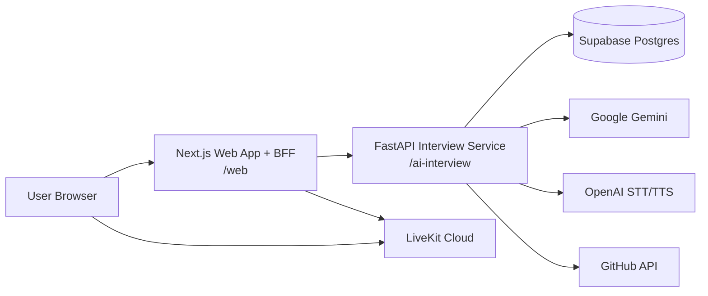
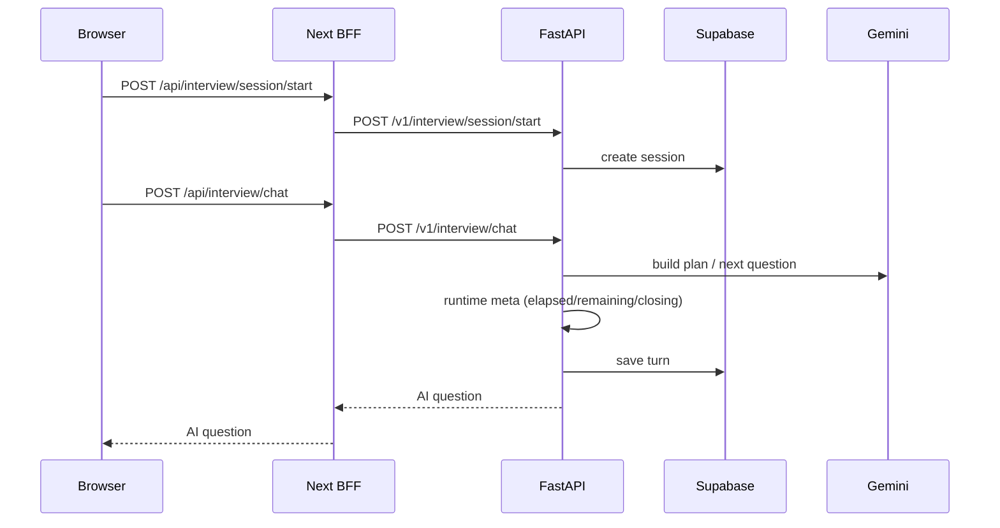
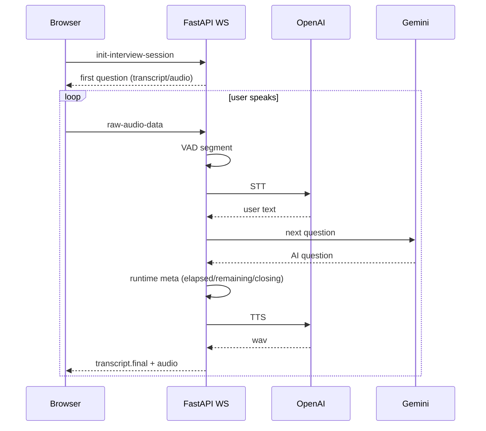

# System Architecture

기준 시점: 2026-02-25

## 1) 전체 아키텍처

핵심 원칙:

- 사용자 UI/인증은 `web`(Next) 유지
- AI 로직/면접 상태 처리는 `ai-interview`(FastAPI) 분리
- Next는 외부 공개 API와 FastAPI 사이 BFF 역할 수행

## 2) 레이어 책임

### Browser / UI

- 면접 Setup, Room, Result, Training(Portfolio Defense)
- LiveKit 프론트 룸 입장
- WS 기반 음성 스트림 송신(현재 구현)

### Next.js (`web`)

- 인증 세션 조회(Supabase auth)
- `/api/interview/*` 프록시
- LiveKit 토큰 발급 라우트

### FastAPI (`ai-interview`)

- JD/이력서 파싱
- 질문 플랜/질문 생성/분석
- 세션/턴/리포트 저장
- WS 음성 처리(STT/TTS)
- 관리자/디버그 API

### DB (Supabase Postgres)

- 세션, 턴, 리포트, 평가 신호, 포트폴리오 소스 저장

## 3) 핵심 플로우

### A. 채팅 면접

### B. 음성 WS 면접 (현재)

### D. 시간 기반 동적 진행 규칙

- 세션 시작 시 `target_duration_sec`(기본 420s), `closing_threshold_sec`(기본 60s) 저장
- `remainingSec <= closingThresholdSec` 진입 시 마무리 질문으로 전환
- 마무리 질문 이후 다음 턴에서 세션 종료(`status=completed`)
- 메타(`remainingSec`, `timeProgressPercent`, `finishReason`)를 응답에 포함
- 동일 규칙을 `live_interview`, `portfolio_defense`에 적용

### C. 포트폴리오 분석/디펜스

- `repoUrl` 입력
- FastAPI가 GitHub API로 공개 레포 검증/수집
- README + 트리 요약 후 디펜스 세션 시작

## 4) 현재 아키텍처 제약

- LiveKit은 UI 레벨 연결 중심이며, 서버 트랙 직접 구독 브리지는 미구현
- 마이페이지 저장 자산 자동 주입 및 RAG 근거검색은 아직 미연동
- 리포트는 단일 분석 중심이며 다단계 평가 파이프라인은 미구현

## 5) 목표 아키텍처(다음 단계)

- 음성 소스 단일화:
  - Browser -> LiveKit publish
  - FastAPI worker -> LiveKit subscribe
- 브리지 추가 시 기대 효과:
  - 다자면접/녹화/분석 확장성 강화
  - 브라우저-서버 이중 오디오 전송 경로 제거
