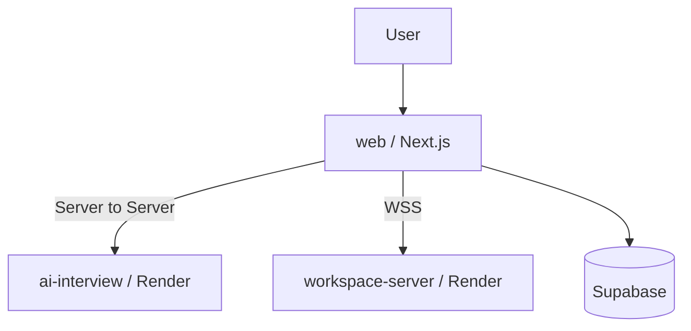

# Dibut Web (Next.js)

사용자에게 보이는 메인 프론트엔드입니다.

- AI 면접 UI
- 워크스페이스 UI
- 커뮤니티/대외활동/기술블로그
- BFF API (`app/api/*`)로 백엔드 중계

## 화면-서버 연결 그림



## 폴더 구조 (요약)

- `app/`: App Router 페이지
- `app/api/`: BFF API
- `components/features/`: 도메인별 UI
- `hooks/`: 실시간/인터뷰 훅
- `store/`: Zustand 상태
- `lib/`: 서버 액션/유틸

## 환경변수

### 공통(필수)

| 키 | 설명 |
|---|---|
| `NEXT_PUBLIC_SUPABASE_URL` | Supabase 프로젝트 URL |
| `NEXT_PUBLIC_SUPABASE_ANON_KEY` | Supabase anon key |
| `SUPABASE_SERVICE_ROLE_KEY` | 서버 라우트용 key |

### AI 면접 연동

| 키 | 예시 |
|---|---|
| `AI_INTERVIEW_BASE_URL` | `https://ai-interview-9p40.onrender.com` |
| `NEXT_PUBLIC_AI_WS_URL` | `wss://ai-interview-9p40.onrender.com/v1/interview/ws/client` |
| `NEXT_PUBLIC_AI_ADMIN_BASE_URL` | `https://ai-interview-9p40.onrender.com/admin` |

### 워크스페이스 연동

| 키 | 예시 |
|---|---|
| `NEXT_PUBLIC_WS_URL` | `wss://dibut-workspace-server.onrender.com` |
| `NEXT_PUBLIC_SOCKET_URL` | `wss://dibut-workspace-server.onrender.com` |

### LiveKit 사용 시

| 키 | 설명 |
|---|---|
| `NEXT_PUBLIC_LIVEKIT_URL` | LiveKit URL |
| `LIVEKIT_API_KEY` | 서버 토큰 발급 키 |
| `LIVEKIT_API_SECRET` | 서버 토큰 발급 시크릿 |
| `LIVEKIT_API_KEY_WORKSPACE` | 워크스페이스용(선택) |
| `LIVEKIT_API_SECRET_WORKSPACE` | 워크스페이스용(선택) |

## 로컬 실행

```bash
cd web
cp .env.example .env.local
pnpm install
pnpm dev
```

## 배포

### Vercel 권장

1. GitHub 연결
2. Root Directory `web` 지정
3. 위 환경변수 입력
4. Deploy

## 주요 스크립트

```bash
pnpm dev
pnpm build
pnpm start
pnpm lint
```
