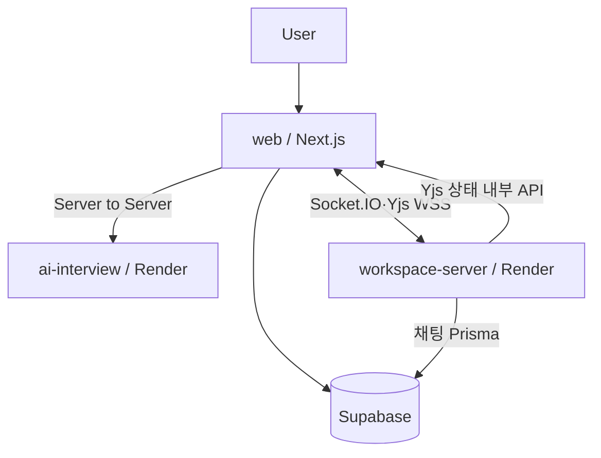

# Debut Web (Next.js)

사용자에게 보이는 메인 프론트엔드입니다.

- AI 면접 UI
- 워크스페이스 UI
- 커뮤니티/채용/기술블로그
- 커리어 문서 스튜디오 (이력서·자소서·포트폴리오)
- BFF API (`app/api/*`)

> 제품의 현재 구조와 운영 기준은 [프로젝트 기준 문서](../docs/PROJECT_REFERENCE.md)를 참조합니다. 이 앱은 단순 중계가 아니라 사용자 UI와 BFF API를 함께 담당합니다.

## 화면-서버 연결 그림


```mermaid
flowchart TB
    U[User] --> WEB[web / Next.js]
    WEB -->|Server to Server| AI[ai-interview / Render]
    WEB <-->|Socket.IO·Yjs WSS| WS[workspace-server / Render]
    WS -->|Yjs 상태 내부 API| WEB
    WEB --> SB[(Supabase)]
    WS -->|채팅 Prisma| SB
```

## 폴더 구조 (요약)

- `app/`: App Router 페이지
- `app/api/`: BFF API
- `components/features/`: 도메인별 UI
- `hooks/`: 실시간/인터뷰 훅
- `store/`: Zustand 상태
- `lib/`: 서버 액션/유틸

## 환경변수

### 공통(필수)

| 키 | 설명 |
|---|---|
| `NEXT_PUBLIC_SUPABASE_URL` | Supabase 프로젝트 URL |
| `NEXT_PUBLIC_SUPABASE_ANON_KEY` | Supabase anon key |
| `SUPABASE_SERVICE_ROLE_KEY` | 서버 라우트용 key |

### AI 면접 연동

| 키 | 예시 |
|---|---|
| `AI_INTERVIEW_BASE_URL` | `https://<ai-interview-service>` |
| `NEXT_PUBLIC_AI_WS_URL` | `wss://<ai-interview-service>/v1/interview/ws/client` |
| `NEXT_PUBLIC_AI_ADMIN_BASE_URL` | `https://<ai-interview-service>/admin` |

### 워크스페이스 연동

| 키 | 실행 위치 | 예시/설명 |
|---|---|---|
| `NEXT_PUBLIC_WS_URL` | 브라우저 | Socket.IO와 문서 Yjs 주소. 로컬 `ws://localhost:4000` |
| `NEXT_PUBLIC_SOCKET_URL` | 브라우저 | 화이트보드 Yjs 주소. 현재 위 값과 동일 |
| `WORKSPACE_SERVER_HTTP_URL` | BFF 서버 | 문서 방 reset/flush 호출 주소. 로컬 `http://localhost:4000` |
| `INTERNAL_API_SECRET` | BFF 서버 | workspace-server와 동일한 긴 랜덤 값 |

워크스페이스 기능의 역할 경계:

- 보드·태스크·일정·멤버·문서 메타데이터·댓글·자산: `app/api/workspaces/**`
- 작업 메뉴는 보드 목록에서 시작하며 보드는 태스크의 수평 분류 단위다. 상세 동작 기준은 [`specs/workspace/boards.md`](../specs/workspace/boards.md)를 따른다.
- 문서 협업 세션·토큰: `app/api/workspaces/[id]/docs/[docId]/collab/**`
- Yjs 문서 상태 내부 API: `app/api/collab/docs/[docId]/state`
- Yjs 화이트보드 상태 내부 API: `app/api/workspaces/[id]/whiteboard`
- 채팅·실시간 문서/화이트보드 전송: `workspace-server`

세부 이벤트와 저장 흐름은 [workspace-server 코드 인수인계](../workspace-server/HANDOVER.md)를 참조합니다.

### LiveKit 사용 시

| 키 | 설명 |
|---|---|
| `NEXT_PUBLIC_LIVEKIT_URL` | LiveKit URL |
| `LIVEKIT_API_KEY` | 서버 토큰 발급 키 |
| `LIVEKIT_API_SECRET` | 서버 토큰 발급 시크릿 |
| `LIVEKIT_API_KEY_WORKSPACE` | 워크스페이스용(선택) |
| `LIVEKIT_API_SECRET_WORKSPACE` | 워크스페이스용(선택) |

## 로컬 실행

```bash
cd web
cp .env.example .env.local
npm install
npm run dev
```

## 배포

### Vercel 권장

1. GitHub 연결
2. Root Directory `web` 지정
3. 위 환경변수 입력
4. Deploy

## 주요 스크립트

```bash
npm run dev
npm run build
npm run start
npm run lint
```
