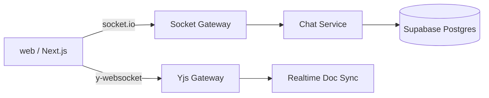

# Dibut Workspace Server

실시간 협업(화이트보드/Yjs, 채팅/Socket.IO)용 Node 서버입니다.

## 구조



## 현재 담당 기능

- Yjs 기반 실시간 동기화 (`ws`)
- Socket.IO 기반 룸/프레즌스/채팅 이벤트
- Prisma를 통한 채팅 영속화

## 환경변수

| 키 | 필수 | 설명 |
|---|---|---|
| `DATABASE_URL` | 예 | Prisma DB 연결 |
| `PORT` | 아니오 | 기본 4000, Render에서는 자동 주입 |
| `DIRECT_URL` | 아니오 | 필요 시 마이그레이션 전용 |

## 로컬 실행

```bash
cd workspace-server
cp .env.example .env
npm install
npm run dev
```

기본 주소:

- `http://localhost:4000`
- WebSocket endpoint base: `ws://localhost:4000`

## Render 배포 설정

- Root Directory: `workspace-server`
- Runtime: `Node`
- Build Command: `npm install`
- Start Command: `npm start`
- 필수 env: `DATABASE_URL`

## 웹 연동 env (web 프로젝트)

- `NEXT_PUBLIC_WS_URL=wss://<workspace-service>.onrender.com`
- `NEXT_PUBLIC_SOCKET_URL=wss://<workspace-service>.onrender.com`
