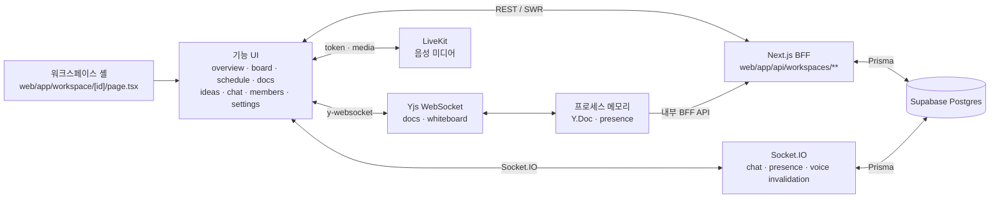

# Debut Workspace

이 문서는 `web`의 워크스페이스 UI·BFF·Prisma와 `workspace-server`의 실시간 계층을 함께 설명하는 코드 기준 README다. 단순 서버 실행법이 아니라, 워크스페이스 기능을 고도화할 때 가장 먼저 확인할 현재 구조와 경계를 기록한다.

- 조사 기준: 2026-07-29, `feature/workspace`
- 제품 전체 기준: [PROJECT_REFERENCE.md](../docs/PROJECT_REFERENCE.md)
- 실시간 서버 인수인계: [HANDOVER.md](HANDOVER.md)
- 브랜치·협업 규칙: [CONTRIBUTING.md](../CONTRIBUTING.md)
- 최소 Spec 작성 기준: [`specs/README.md`](../specs/README.md)

README에 기능 요구사항을 계속 누적하지 않는다. 여기에는 현재 구현 구조와 공통 제약을 유지하고, 실제 변경의 의도·범위·완료 조건은 짧은 기능 Spec에 기록한다.

## 한눈에 보는 구조


```mermaid
flowchart LR
    Page["워크스페이스 셸<br/>web/app/workspace/[id]/page.tsx"]
    UI["기능 UI<br/>overview · board · schedule · docs<br/>ideas · chat · members · settings"]
    BFF["Next.js BFF<br/>web/app/api/workspaces/**"]
    DB[("Supabase Postgres")]
    SIO["Socket.IO<br/>chat · presence · voice invalidation"]
    YWS["Yjs WebSocket<br/>docs · whiteboard"]
    Memory["프로세스 메모리<br/>Y.Doc · presence"]
    LiveKit["LiveKit<br/>음성 미디어"]

    Page --> UI
    UI <-->|REST / SWR| BFF
    BFF <-->|Prisma| DB
    UI <-->|Socket.IO| SIO
    SIO <-->|Prisma| DB
    UI <-->|y-websocket| YWS
    YWS <--> Memory
    Memory -->|내부 BFF API| BFF
    UI <-->|token · media| LiveKit
```

기능별 저장·동기화 방식은 서로 다르다.

| 기능 | 화면 진입점 | 읽기·쓰기 경로 | 실시간 여부 |
| --- | --- | --- | --- |
| 대시보드 | `detail/dashboard-overview.tsx` | workspace/board BFF | 아니오 |
| 칸반 | `detail/kanban-board.tsx` | board BFF + SWR + Zustand | 아니오 |
| 일정 | `detail/schedule-view.tsx` | board BFF의 `dueDate` 재사용 | 아니오 |
| 문서 | `detail/docs-view.tsx` | 일반 모드 BFF, 협업 모드 Yjs | 협업 모드만 |
| 아이디어 보드 | `detail/idea-board/idea-board-sdk.tsx` | Yjs + Excalidraw | 예 |
| 채팅 | `detail/chat/team-chat.tsx` | Socket.IO + server Prisma | 예 |
| 음성 | `VoiceManager` 계열 | LiveKit + BFF token | 예 |
| 멤버·설정 | detail view + workspace BFF | REST | 아니오 |

## 워크스페이스 셸

실제 페이지 진입점은 `web/app/workspace/[id]/page.tsx`다.

- URL query의 `tab`, `doc`, `task`가 현재 탭과 선택 대상을 표현한다.
- 주요 기능 화면은 `next/dynamic`으로 지연 로드한다.
- 사이드바 접힘 상태는 워크스페이스별 `localStorage` 키로 저장한다.
- 워크스페이스 메타데이터는 SWR로 읽고, focus 재검증 없이 30초 dedupe를 사용한다.
- 사용자와 워크스페이스 정보가 준비되고 읽기 전용이 아닐 때 Socket.IO에 연결한다.
- 문서 탭을 떠날 때 일반 편집기의 저장 전 처리기를 실행한다.
- `COMPLETED` 워크스페이스는 UI와 BFF 쓰기 경로에서 읽기 전용으로 취급한다. 채팅과 허들은 셸에서 차단한다.

현재 셸이 직접 사용하는 구현은 `kanban-board.tsx`, `docs-view.tsx`, `dashboard-overview.tsx`다. 아래 파일은 이름이 비슷하지만 현재 셸 import 경로에서 확인되지 않은 이전 구현 후보이므로, 삭제 전 동적 참조 여부를 다시 확인해야 한다.

- `detail/board/index.tsx`
- `detail/docs/index.tsx`
- `detail/overview/index.tsx`

## 칸반과 일정

### 현재 기능

- 컬럼 생성·수정·삭제·순서 변경
- 태스크 생성·수정·삭제·드래그 이동
- 담당자, 우선순위, 태그, 마감일
- status, assignee, priority, tag 기준 그룹
- Kanban/table 보기, 숨김 그룹, 카드 속성, 사용자 정의 view 순서
- 태스크와 문서의 다대다 연결 및 대표 문서 지정
- 마감일이 있는 태스크를 FullCalendar 일정으로 표시

기준 API는 `web/app/api/workspaces/[id]/board/**`, 태그 API는 `web/app/api/workspaces/[id]/tags/**`, 문서 연결은 `board/tasks/[taskId]/documents/**`다.

### 데이터 흐름

1. `kanban-board.tsx`가 `/api/workspaces/:id/board`를 SWR로 조회한다.
2. 조회 결과를 `web/components/features/workspace/store/mock-data.ts`의 Zustand store에 매핑한다.
3. UI가 store를 먼저 갱신하거나 API를 호출한 뒤 SWR `mutate`로 서버 상태를 다시 받는다.
4. 일정 화면은 별도 일정 모델 없이 같은 board API의 `dueDate`를 달력 이벤트로 변환한다.

`mock-data.ts`라는 이름과 데모 초기값이 남아 있지만 현재 화면의 실제 DB 데이터를 `syncProjectData`로 받는 활성 경로다. 파일명을 근거로 제거하면 안 된다.

### 제약

- 칸반 변경은 Socket.IO나 Yjs로 전파되지 않는다. 다른 사용자는 재조회 전까지 변경을 보지 못할 수 있다.
- SWR focus 재검증이 꺼져 있고 30초 dedupe가 있어 협업 보드로서 최신성 보장이 약하다.
- DnD의 영속 순서는 현재 status 그룹 중심이다. tag 그룹에서는 태스크 드래그가 비활성화된다.
- 일부 비동기 갱신 경로의 오류 피드백과 rollback이 일관되지 않다.
- 생성 시 `max(order) + 1` 방식은 동시 생성 경쟁에서 같은 순서를 만들 수 있다.
- `kanban_tasks.tags`는 문자열 배열이고 `kanban_tags`는 별도 테이블이라 FK 무결성이 없다.
- `kanban-board.tsx` 약 1,389줄, store 약 941줄로 화면·매핑·명령 책임이 크다.
- 워크스페이스 칸반·일정 전용 자동화 테스트는 현재 확인되지 않는다.

## 문서

실제 오케스트레이터는 약 3,489줄의 `detail/docs-view.tsx`다. 편집기는 다음 두 경로로 분리된다.

- 일반 편집기: `web/components/features/workspace/docs/normal-editor.tsx`
- 협업 편집기: `web/components/features/workspace/docs/editor.tsx`

### 현재 기능

- page/folder 계층, drag reorder, archive
- BlockNote 기반 본문, 제목·emoji·cover
- 템플릿 생성·적용
- 문서 파일 자산 업로드·조회·삭제
- 댓글, 답글, block anchor, resolve
- 태스크 연결과 문서 본문의 `#` 태스크 참조
- 일반 편집과 명시적 실시간 협업 모드

### 일반 편집

1. BlockNote block JSON을 로컬 dirty 상태로 관리한다.
2. 수동 저장, `Ctrl/Cmd+S`, 탭 이탈 전 저장으로 `/docs/:docId/save`를 호출한다.
3. 일반 저장은 `workspace_docs.content`를 갱신한다.
4. 기존 Yjs 상태를 제거해 다음 협업 시작 시 최신 JSON snapshot으로 다시 seed한다.

### 협업 편집

1. 협업 시작 전에 일반 편집 내용을 저장한다.
2. BFF가 workspace membership과 쓰기 가능 상태를 확인한다.
3. 다른 일반 편집자에게 미저장 변경이 있으면 협업 시작을 막는다.
4. BFF가 `docId`, `workspaceId`, `userId`, 만료 시각을 담은 5분 HMAC token을 발급한다.
5. 클라이언트가 `doc:<docId>` Yjs room에 연결하고 BlockNote와 Y.Doc을 연결한다.
6. workspace-server가 변경 3초 후, 연결 중 30초마다, 마지막 연결 종료 시 전체 Yjs 상태를 BFF에 저장한다.
7. BFF는 `workspace_doc_states.yjs_state`와 변환된 `workspace_docs.content`를 한 트랜잭션으로 갱신한다.

협업 세션은 `workspace_doc_collab_sessions`, 편집 모드·dirty 상태는 `workspace_doc_live_presence`에 저장한다. 클라이언트 heartbeat는 10초, 서버가 유효하게 보는 presence TTL은 30초다.

### 제약

- JSON snapshot과 Yjs 상태의 이중 표현, 일반/협업 모드 전환, 제목과 본문의 별도 저장 경로가 복잡도를 높인다.
- 협업 화면의 “동기화됨”은 WebSocket/Yjs protocol sync 상태이지 DB 영속화 완료 확인이 아니다.
- Yjs 저장 실패가 브라우저에 전달되지 않는다.
- 마지막 사용자가 나갈 때 저장 함수가 내부 오류를 삼킨 뒤 room을 메모리에서 제거할 수 있어 데이터 유실 가능성이 있다.
- debounce, 주기 저장, 퇴장 저장을 직렬화하거나 version 검사하지 않아 요청 완료 순서 역전 위험이 있다.
- 연결 시 token을 검사하지만 연결 후 token 만료나 membership 회수는 기존 연결에 즉시 반영되지 않는다.
- 전체 Yjs state를 매번 Base64로 저장하며 크기 제한·증분 이력·복구 버전이 없다.
- DB heartbeat는 background tab과 네트워크 지연에 민감하고 요청량이 늘어난다.
- `workspace_doc_states.updated_by`가 실시간 저장의 감사 주체로 일관되게 기록되지 않는다.
- 문서 UI와 편집기 계층을 대상으로 한 자동화 테스트는 현재 확인되지 않는다.

## 아이디어 보드

아이디어 보드는 Excalidraw 0.17 계열, Yjs, `y-websocket`, `y-excalidraw`를 사용한다.

- room 이름: `whiteboard:<workspaceId>`
- `elements`는 Y.Array, 파일 자산은 Y.Map으로 동기화한다.
- awareness에 사용자 ID·표시명·cursor 색상을 넣는다.
- 서버는 `workspace_whiteboards.yjs_state`에 전체 상태를 저장한다.
- 완료 워크스페이스의 `viewModeEnabled`는 현재 클라이언트가 설정한다.

### 우선 해결할 문제

- workspace-server는 `doc:*`만 token을 검사한다. `whiteboard:*`는 인증과 membership 검사가 없다.
- 워크스페이스 UUID를 아는 비회원도 WebSocket 연결·상태 수신·변경 방송을 시도할 수 있다.
- 완료 워크스페이스도 서버 메모리에서는 변경이 방송될 수 있고, BFF 저장 단계에서만 거절된다.
- awareness 사용자 정보도 서버에서 검증하지 않아 신뢰할 수 있는 신원 정보가 아니다.
- payload·파일 크기·rate limit가 없고 자산이 전체 Yjs state 크기를 키울 수 있다.
- 연결 표시는 WebSocket 연결 여부이며 DB 저장 성공 여부가 아니다.
- 같은 React 인스턴스에서 `projectId`만 바뀌면 기존 Y.Doc ref를 재사용할 여지가 있다. 라우트 전환 시 문서 재생성 또는 명시적 destroy가 필요하다.

## 채팅과 프레즌스

채팅은 `web/components/features/workspace/store/socket-store.ts`와 `workspace-server/src/modules/chat/**`가 담당한다.

- 채널 조회·생성·삭제
- 채널 입장·퇴장
- 메시지 조회·작성·수정·삭제
- typing event
- mention notification
- 워크스페이스 online/offline presence

workspace-server가 `workspace_channels`, `workspace_messages`, `notifications`를 Prisma로 직접 읽고 쓴다. 알림·mention count의 일부는 클라이언트 store에서 관리하고, 메시지는 현재 전체 목록을 한 번에 조회한다.

### 우선 해결할 문제

- Socket.IO handshake에 Supabase access token 인증이 없다.
- `join`이 클라이언트의 `userId`, `projectId`를 신뢰하며 membership을 확인하지 않는다.
- 채팅 이벤트도 `workspaceId`, `channelId`, `senderId`, `requesterId`를 신뢰한다.
- 따라서 다른 사용자를 사칭하거나 알게 된 채널·워크스페이스 식별자로 접근할 가능성이 있다.
- read-only DB 확인은 조회 오류 시 fail-open이므로 장애 중 쓰기를 허용할 수 있다.
- private channel 타입은 있지만 서버 측 채널 membership 권한 모델이 없다.
- 메시지 pagination, payload schema·크기 제한, rate limit가 없다.
- presence는 프로세스 메모리 기반이다. 같은 사용자의 여러 연결 중 하나만 끊겨도 offline이 방송될 수 있다.
- 멀티 인스턴스에서는 room, presence, broadcast가 공유되지 않는다.

현재 `board.gateway.ts`의 `board:*` Socket.IO relay는 웹 화이트보드가 사용하지 않는 이전 구현이다. 화이트보드는 Yjs 경로를 사용한다.

## 음성·허들

실제 음성 미디어는 workspace-server가 아니라 LiveKit을 사용한다.

- BFF token 경로가 Supabase session, workspace membership, 완료 상태를 확인한다.
- participant 조회 API와 Socket.IO `voice:update`는 목록 재조회에 사용한다.
- `voice:update`는 미디어를 전달하지 않고 invalidation 신호만 보낸다.

워크스페이스의 `LiveHuddle` 탭은 로컬 store 중심의 preview/mock 성격 UI가 남아 있고, 실제 통화 UI는 `VoiceManager`와 `ActiveCallOverlay` 계열이다. 두 진입 경험을 하나로 정리해야 상태와 기능 기대가 일치한다.

## 완료와 읽기 전용

`workspace_lifecycle_status`는 `IN_PROGRESS`, `COMPLETED` 두 상태다.

- owner만 완료할 수 있다.
- 완료 API는 결과 메타데이터와 구성원별 완료 태스크를 정리하고 평판·커리어 가져오기 후보를 만든다.
- 주요 BFF write route는 `ensureWorkspaceWritable`을 사용한다.
- 셸은 완료 상태에서 board/docs/ideas를 읽기 전용으로 표시하고 chat/huddle 연결을 막는다.

하지만 모든 실시간 입구가 동일한 정책을 강제하지는 않는다. 특히 인증 없는 whiteboard Yjs와 fail-open Socket.IO 검사를 서버 경계에서 먼저 통일해야 한다.

## 데이터 모델 소유권

기준 스키마와 migration 소유자는 `web/prisma/schema.prisma`, `web/prisma/migrations/**`다.

| 영역 | 기준 모델 |
| --- | --- |
| 공간·멤버 | `workspaces`, `workspace_members`, `workspace_invites` |
| 칸반 | `kanban_columns`, `workspace_views`, `kanban_tags`, `kanban_tasks`, `kanban_task_documents` |
| 문서 | `workspace_docs`, `workspace_doc_states`, `workspace_doc_collab_sessions`, `workspace_doc_live_presence`, `workspace_doc_assets`, `workspace_doc_templates`, `workspace_doc_comments` |
| 화이트보드 | `workspace_whiteboards` |
| 채팅 | `workspace_channels`, `workspace_messages` |
| 알림 | `notifications` |

`workspace-server/prisma/schema.prisma`는 채팅 런타임용 Prisma Client를 만드는 follower다. 이 파일만 수정해 migration을 만들면 안 된다. 기준 스키마를 변경한 뒤 server가 실제 사용하는 모델과 필드만 follower에 맞춘다.

## workspace-server 구조와 프로토콜

```text
workspace-server/
├── src/
│   ├── index.ts
│   ├── config/env.ts
│   └── modules/
│       ├── auth/auth.service.ts
│       ├── board/
│       │   ├── board.gateway.ts
│       │   ├── workspace-doc-collab-token.ts
│       │   ├── yjs.gateway.ts
│       │   └── yjs-utils.ts
│       ├── chat/
│       │   ├── chat.gateway.ts
│       │   ├── chat.service.ts
│       │   └── chat.types.ts
│       └── socket/socket.gateway.ts
├── prisma/schema.prisma
├── package.json
├── render.yaml
└── tsconfig.json
```

포트 4000의 단일 Node.js HTTP server가 Socket.IO와 Yjs WebSocket upgrade를 함께 처리한다.

| 경로·이벤트 | 역할 |
| --- | --- |
| Socket.IO `join`, `presence:update` | 워크스페이스 입장과 상태 방송 |
| Socket.IO `chat:*` | 채널·메시지·typing |
| Socket.IO `voice:update` | LiveKit 참가자 목록 재조회 신호 |
| Yjs `doc:<docId>` | BlockNote 문서 협업 |
| Yjs `whiteboard:<workspaceId>` | Excalidraw 협업 |
| `POST /internal/yjs/docs/:docId/reset` | 비활성 문서 room 제거 |
| `POST /internal/yjs/docs/:docId/flush` | 메모리의 문서 상태 즉시 저장 |

`auth.service.ts`, `chat.types.ts`, Socket.IO `board:*`는 현재 주 실행 경로의 인증 또는 화이트보드 동기화에 사용되지 않는 레거시 후보 코드다.

## 기술 부채 우선순위

### P0 — 기능 추가 전에 막아야 함

1. Socket.IO handshake 인증과 server-derived user identity
2. 모든 chat/join/voice 이벤트의 workspace·channel authorization
3. whiteboard Yjs token, membership, writable 검증
4. Yjs 저장 실패 전파, retry, 저장 직렬화, 마지막 연결 종료 시 안전한 room 해제

### P1 — 협업 신뢰성

1. 멀티 인스턴스 Socket.IO adapter와 공유 Yjs persistence/coordination
2. 칸반 변경 실시간 전파 또는 명시적인 재검증 정책
3. 메시지 pagination, validation, size/rate limit
4. 문서·화이트보드의 저장 acknowledgment와 version/recovery
5. 실시간 서버 readiness, graceful shutdown과 종료 전 flush

### P2 — 구조와 UX

1. `docs-view.tsx`, `kanban-board.tsx`, `mock-data.ts` 책임 분리
2. 이전 board/docs/overview 구현과 mock huddle 정리
3. 정상·실패·재연결·동시편집 자동화 테스트
4. 칸반 tag 정규화와 동시 순서 갱신 규칙
5. 문서 일반/협업 모드 전환 UX와 저장 상태 표현 단순화

## 변경 원칙

- 인증·권한은 클라이언트 payload가 아니라 검증된 session/token에서 사용자 ID를 얻는다.
- membership, role, workspace lifecycle 검사는 HTTP와 WebSocket 양쪽 경계에서 동일하게 적용한다.
- “연결됨”, “동기화됨”, “DB에 저장됨”을 서로 다른 상태로 표시한다.
- 낙관적 UI는 실패 rollback 또는 강제 재조회 경로를 함께 둔다.
- 실시간 기능을 멀티 인스턴스로 확장할 때 메모리 Map을 공유 상태처럼 가정하지 않는다.
- 큰 파일을 수정할 때 화면, server state, transport, persistence 책임을 먼저 분리한다.
- 작은 작업은 `feature/workspace`에서 커밋으로 구분하고, 기능마다 새 브랜치를 만들지 않는다.

## 환경변수와 실행

### workspace-server

| 키 | 필수 | 용도 |
| --- | --- | --- |
| `DATABASE_URL` | 예 | 채팅·알림 Prisma 연결 |
| `DIRECT_URL` | Prisma 명령 사용 시 | follower schema direct connection |
| `BFF_URL` | 예 | Yjs 상태 로드·저장 대상 Next.js 주소 |
| `INTERNAL_API_SECRET` | 예 | BFF 내부 API와 문서 협업 HMAC 서명 |
| `PORT` | 아니오 | 기본값 `4000` |

### web

| 키 | 용도 |
| --- | --- |
| `NEXT_PUBLIC_WS_URL` | Socket.IO와 문서 Yjs server 주소 |
| `NEXT_PUBLIC_SOCKET_URL` | whiteboard Yjs server 주소 |
| `WORKSPACE_SERVER_HTTP_URL` | BFF가 reset/flush를 호출할 내부 HTTP 주소 |
| `INTERNAL_API_SECRET` | workspace-server와 동일한 값 |

```bash
cp workspace-server/.env.example workspace-server/.env
cp web/.env.example web/.env.local

cd web
npm install
npm run dev

# 별도 터미널
cd workspace-server
npm install
npm run dev
```

workspace-server의 개발 명령은 `tsx watch src/index.ts`, 시작 명령은 `tsx src/index.ts`다. 현재 별도의 compile, lint, test script가 없다. 기타 HTTP 요청에 대한 200 실행 문자열은 DB와 BFF 의존성을 검사하는 readiness endpoint가 아니다.

`render.yaml` 기준 배포는 Node runtime, `npm install`, `npm start`이며 `DATABASE_URL`, `BFF_URL`, `INTERNAL_API_SECRET`이 필요하다.
