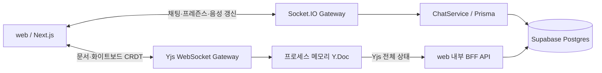

# Debut Workspace Server

`workspace-server`는 Debut 워크스페이스의 실시간 전송 계층이다. 포트 4000의 단일 Node.js HTTP 서버에서 Socket.IO와 Yjs WebSocket을 함께 실행한다.

제품 전체 기준은 [프로젝트 기준 문서](../docs/PROJECT_REFERENCE.md), 코드 수준 계약과 주의사항은 [HANDOVER.md](HANDOVER.md)를 따른다.

## 런타임 구조


```mermaid
flowchart LR
    Web[web / Next.js]
    SIO[Socket.IO Gateway]
    YWS[Yjs WebSocket Gateway]
    Chat[ChatService / Prisma]
    Memory[프로세스 메모리 Y.Doc]
    BFF[web 내부 BFF API]
    DB[(Supabase Postgres)]

    Web <-->|채팅·프레즌스·음성 갱신| SIO
    SIO --> Chat
    Chat --> DB
    Web <-->|문서·화이트보드 CRDT| YWS
    YWS --> Memory
    Memory -->|Yjs 전체 상태| BFF
    BFF --> DB
```

### 책임

- Socket.IO 워크스페이스 방 입장과 연결 상태 관리
- 채널·메시지 실시간 이벤트 및 Prisma 영속화
- 음성방 참가자 목록 재조회용 갱신 이벤트 릴레이
- 문서와 화이트보드의 Yjs 동기화
- Yjs 상태를 `web` 내부 API로 로드·저장
- 문서 협업 방 reset/flush 내부 HTTP API

칸반, 일정, 문서 메타데이터, 댓글, 자산, 멤버·설정 API는 `web/app/api/workspaces/**`가 담당한다. 실제 음성 미디어는 LiveKit이 담당하며 이 서버를 통과하지 않는다.

## 코드 구조

```text
workspace-server/
├── src/
│   ├── index.ts
│   ├── config/
│   │   └── env.ts
│   └── modules/
│       ├── auth/
│       │   └── auth.service.ts
│       ├── board/
│       │   ├── board.gateway.ts
│       │   ├── workspace-doc-collab-token.ts
│       │   ├── yjs.gateway.ts
│       │   └── yjs-utils.ts
│       ├── chat/
│       │   ├── chat.gateway.ts
│       │   ├── chat.service.ts
│       │   └── chat.types.ts
│       └── socket/
│           └── socket.gateway.ts
├── prisma/
│   └── schema.prisma
├── package.json
├── render.yaml
└── tsconfig.json
```

`auth.service.ts`, `chat.types.ts`, Socket.IO `board:*` 이벤트는 현재 주 실행 경로에서 인증 또는 화이트보드 동기화에 사용되지 않는 레거시 코드다.

## 프로토콜과 저장 경계

### Socket.IO

| 이벤트 | 방향 | 역할 |
| --- | --- | --- |
| `join` | client → server | `userId`, `projectId`를 받아 워크스페이스 방 입장 |
| `workspace:readonly` | server → client | 완료된 워크스페이스 연결 차단 |
| `presence:update` | server → room | online/offline 상태 방송 |
| `voice:update` | 양방향 | 음성방 목록 재조회 신호 |
| `chat:get_channels` | client → server | 채널 목록 조회, 없으면 `general` 생성 |
| `chat:create_channel` / `chat:delete_channel` | client → server | 채널 생성·삭제 |
| `chat:join` / `chat:leave` | client → server | 채널 Socket.IO room 입장·퇴장 |
| `chat:get_messages` | client → server | 채널 메시지 전체 조회 |
| `chat:message` | 양방향 | 메시지 저장·방송 |
| `chat:update_message` / `chat:delete_message` | 양방향 | 메시지 수정·삭제 |
| `chat:typing` | 양방향 | 입력 상태 릴레이 |
| `board:join` / `board:update` | 양방향 | 현재 웹 화이트보드가 사용하지 않는 레거시 릴레이 |

채팅은 workspace-server가 `workspace_channels`, `workspace_messages`, `notifications`를 Prisma로 직접 읽고 쓴다.

### Yjs WebSocket

| 방 | 클라이언트 | 서버 인증 | 영속화 API |
| --- | --- | --- | --- |
| `doc:<docId>` | BlockNote 문서 편집기 | BFF가 발급한 5분 HMAC 토큰 | `/api/collab/docs/:docId/state` |
| `whiteboard:<workspaceId>` | Excalidraw | 현재 없음 | `/api/workspaces/:id/whiteboard` |

Yjs 문서는 프로세스 메모리에 유지하며 변경 3초 후, 연결 중 30초마다, 마지막 연결 종료 시 전체 상태를 Base64로 저장한다. 문서 저장은 BFF에서 `workspace_doc_states.yjs_state`와 `workspace_docs.content`를 트랜잭션으로 갱신한다.

### 내부 HTTP

| 경로 | 메서드 | 인증 | 역할 |
| --- | --- | --- | --- |
| `/internal/yjs/docs/:docId/reset` | POST | `x-internal-secret` | 비활성 문서 방 메모리 제거 |
| `/internal/yjs/docs/:docId/flush` | POST | `x-internal-secret` | 현재 문서 상태 즉시 저장 |
| 기타 경로 | GET 등 | 없음 | 현재 단순 실행 문자열과 200 반환 |

## 스키마 소유권

워크스페이스 도메인의 기준은 `web/prisma/schema.prisma`와 `web/prisma/migrations/**`다. 이 디렉토리의 `prisma/schema.prisma`는 채팅 런타임에 필요한 Prisma Client를 위한 follower이며, 현재 기준 스키마보다 모델 범위가 작다.

- 마이그레이션 생성·적용은 `web`에서 수행한다.
- 워크스페이스 모델 변경 후 workspace-server가 사용하는 모델과 필드를 follower 스키마에 맞춘다.
- workspace-server 스키마만 수정해 DB 마이그레이션을 만들지 않는다.

## 환경변수

### workspace-server

| 키 | 필수 | 용도 |
| --- | --- | --- |
| `DATABASE_URL` | 예 | 채팅·알림 Prisma 연결 |
| `DIRECT_URL` | Prisma 명령 사용 시 | follower 스키마의 direct connection |
| `BFF_URL` | 예 | Yjs 상태 로드·저장 대상 Next.js 주소 |
| `INTERNAL_API_SECRET` | 예 | BFF 내부 API와 문서 협업 HMAC 서명 |
| `PORT` | 아니오 | 기본값 `4000` |

### web

| 키 | 용도 |
| --- | --- |
| `NEXT_PUBLIC_WS_URL` | Socket.IO와 문서 Yjs 서버 주소 |
| `NEXT_PUBLIC_SOCKET_URL` | 화이트보드 Yjs 서버 주소 |
| `WORKSPACE_SERVER_HTTP_URL` | BFF가 reset/flush를 호출할 서버 내부 HTTP 주소. 없으면 WSS URL에서 유도 |
| `INTERNAL_API_SECRET` | workspace-server와 동일한 값 |

로컬에서는 두 공개 URL을 모두 `ws://localhost:4000`으로 설정한다.

## 로컬 실행

```bash
cp workspace-server/.env.example workspace-server/.env
cp web/.env.example web/.env.local

cd web
npm install
npm run dev

# 별도 터미널
cd workspace-server
npm install
npm run dev
```

workspace-server의 실행 명령은 `tsx watch src/index.ts`, 배포 명령은 `tsx src/index.ts`다. 현재 별도의 compile, lint, test 스크립트는 없다.

## 현재 운영상 제약

- Socket.IO handshake에서 Supabase 사용자 토큰을 검증하지 않는다.
- 채팅 이벤트가 클라이언트의 `userId`, `requesterId`, `workspaceId`, `channelId`를 신뢰한다.
- 화이트보드 Yjs 연결에는 인증·멤버십 검사가 없다.
- Socket.IO 방, 프레즌스, Yjs 문서는 프로세스 메모리에 있어 단일 프로세스를 전제로 한다.
- Yjs 상태 로드·저장 실패가 연결을 중단시키지 않으며 저장 성공 여부가 클라이언트 상태 표시에 반영되지 않는다.
- 메시지 조회 pagination, payload schema 검증, 크기 제한, rate limit가 없다.
- 실행 상태 응답은 DB·BFF 의존성을 검사하는 readiness endpoint가 아니다.

이 제약을 건드리는 기능 개발 전에는 [HANDOVER.md](HANDOVER.md)의 변경 체크리스트를 확인한다.

## 기능 개발 문서

워크스페이스 기능은 `web`, BFF, Prisma, workspace-server를 함께 변경할 수 있으므로 상세 Spec을 이 README에 누적하지 않는다.

- 브랜치·PR 규칙: [`CONTRIBUTING.md`](../CONTRIBUTING.md)
- Spec 구조와 AI 작업 규칙: [`specs/README.md`](../specs/README.md)
- 워크스페이스 기능 Spec: `specs/workspace/<번호>-<기능명>/`
- 현재 구현과 제약: [`HANDOVER.md`](HANDOVER.md)

## 현재 배포

`render.yaml` 기준:

- Runtime: Node
- Build: `npm install`
- Start: `npm start`
- 필수 환경변수: `DATABASE_URL`, `BFF_URL`, `INTERNAL_API_SECRET`
